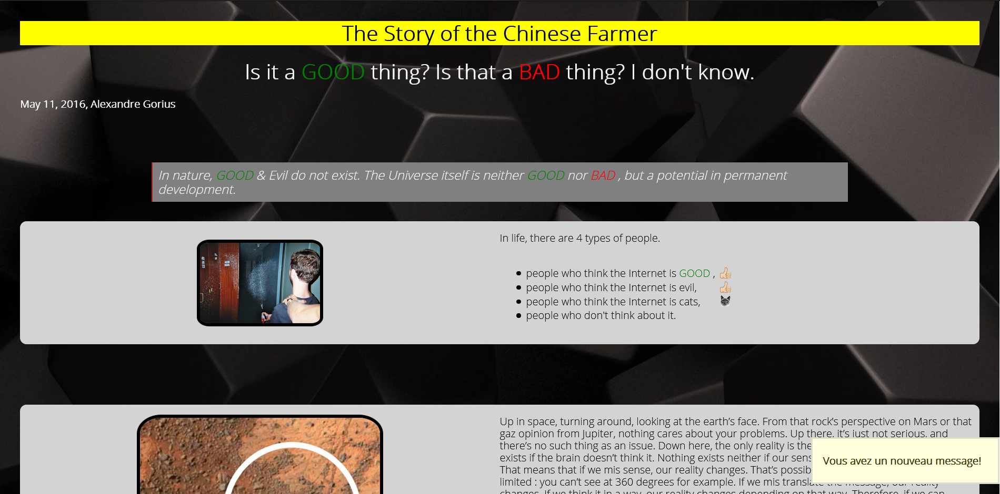
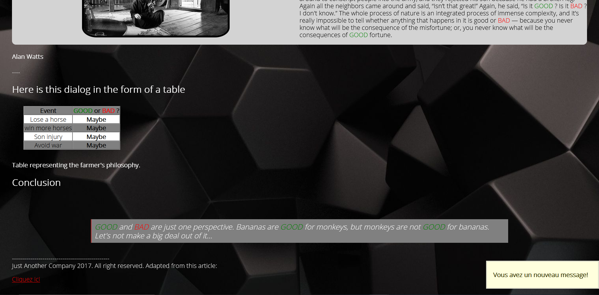

# **Le fermier chinois**

## Quoi ?

C'est un travail qui consiste à transformer un document text en HTML en utilisant le language html et css. C'est un travail à faire individuellement afin de voir notre capacités a chrcher les informations de nous-même sur internet.

## Quand ai-je bossé dessus ?

Nous devions terminer le travail pour le 28/10 et nous avons eu 3 jours pour le terminer. J'ai avancé à mon rythme afin de bien assimiler la matière et les outils mis à ma dispositions.

## Qu'est ce que ça contient ?

C'est un document texte transformer en site web a l'aide des languages html et css et qui permet de voir nos capacités à ameliorer, modifier un site web ç l'aide des outils mis à dispositions. Elle contient des images, des citations ainsi que des petit texte sur l'histoire du fermier chinois. 

#### **Voici un exemple du site en lui-même :** 

#### **Lien du site web :**

https://khalidmengat.github.io/progression/

# **COnclusion**

Ce travail à été très enrichissant que ce soit en html ou en css, cela m'a permis d'approfondir mes connaissances ainsi que de l'expérience dans les modifications ou dans l'améioration de site web.

